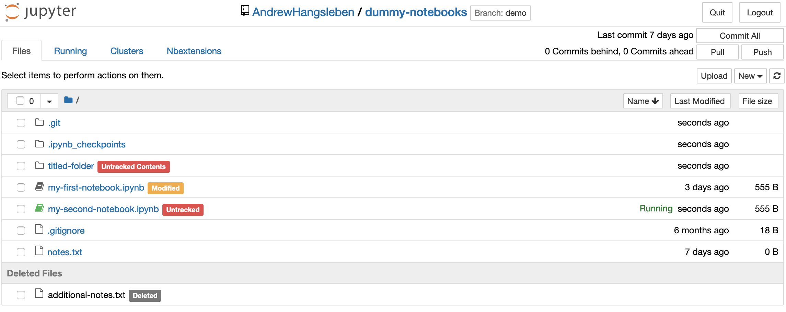
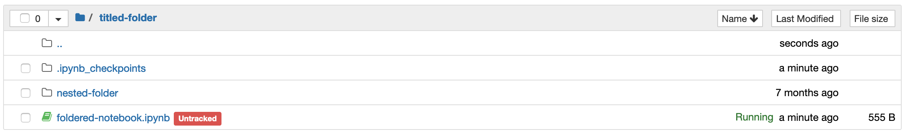
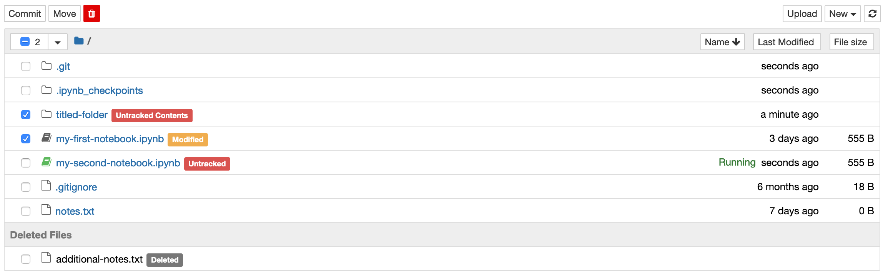
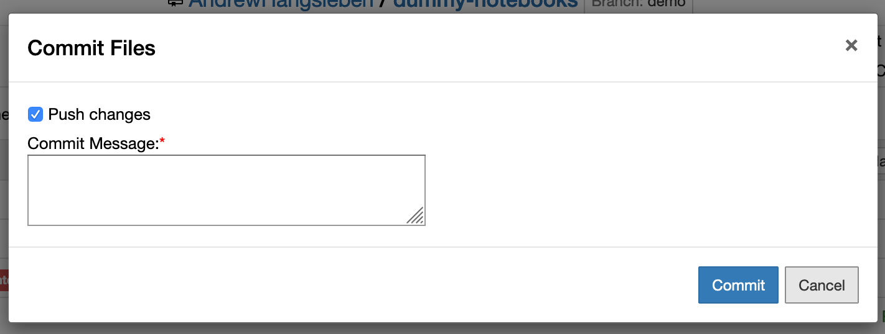
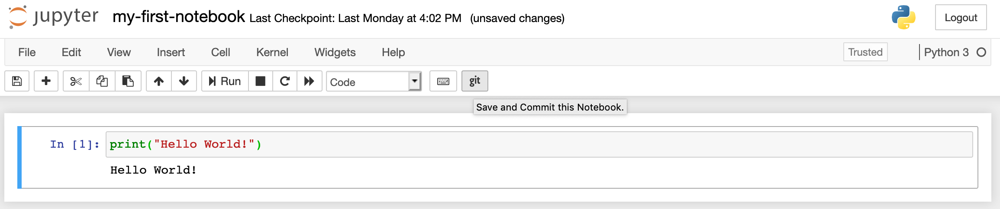
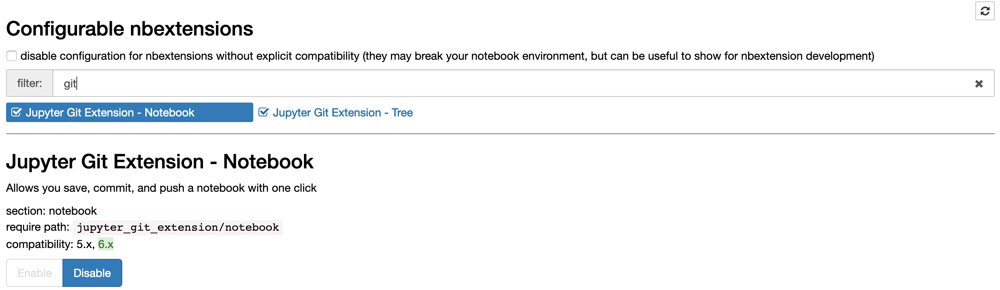

# jupyter_git_extension
Jupyter® extension to add git® functionality to the file browser. Composed of a server
extension to provide an API and a front-end extension to interface with it.


## Installation
Clone or download the code locally and run the following commands from the same
directory as this README:
```bash
pip install .
```

The extension should enable itself and be available the next time you launch a jupyter
notebook. If the extension is not enabled for some reason you can manually enable it
with the following commands:
```bash
jupyter serverextension enable --py jupyter_git_extension
jupyter nbextension enable --py jupyter_git_extension
```

## Usage
Launch jupyter from the root of a git project. Ex:
```bash
jupyter notebook
```

The main tree (file list) page will now have git information integrated:
- Links to your git org/repo will be included in the header
- Basic git functions added via buttons on the top-right of the page
- Basic git status added to the top-right of the page
- Files/directories will list their current git status (modified/untracked/deleted)
- Deleted files section will show any locally deleted files that haven't been committed



Nested folders will keep track of status too!


You can commit all files using the button in the top right, or select specific files and
only commit those.


When committing you'll be given a chance to input a commit message and optionally push
the changes (you can also push later from the dedicated `Push` button).


The extension is also accessible from the notebook editor. When used from the editor it
will save, commit, and optionally push the specific file you're working on.



### Nbextensions integration
If you have the nbextensions extension enabled you can enable/disable the tree and
notebook sections of the git extension from the `Nbextensions` tab on the tree page.



## Code Contributions
[Please check out our contribution guidelines first!](CONTRIBUTING.md)
Developer dependencies are managed via pipenv. It can be installed with
```bash
pip install pipenv
```
Add your dependencies to the `Pipfile` and install them (from the same directory as
`Pipfile`) with:
```bash
pipenv install --dev
```
Run commands inside the pipenv with
```bash
pipenv run <command>
```


### Formatting
Code is expected to match the formatting output by the python `black` package. You can
run your code through the formatter with:
```bash
pipenv run black <path to code>
```
or just run it on the entire codebase with
```bash
pipenv run black .
```

`black` is configured in the `pyproject.toml` file. Pull requests will automatically
check your code and fail the check if it isn't formatted with `black`.


### Testing
Code is expected to run through test cases. You can run the tests with
```bash
pipenv run pytest
```


# Legal Notices
"Jupyter®" and the Jupyter® logos are trademarks or registered trademarks of NumFOCUS,
used by Target with permission.

Git® and the Git® logo are either registered trademarks or trademarks of Software
Freedom Conservancy, Inc., corporate home of the Git Project, in the United States
and/or other countries.
